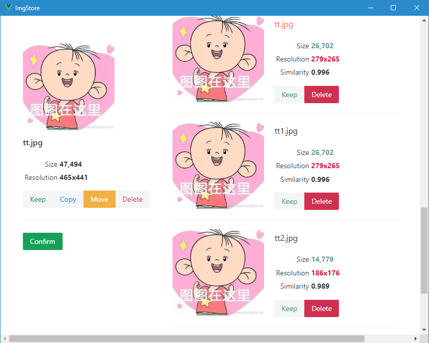

> 这个图图我曾存过的。

# ImgStore

#### 主要是为了实现自己的一个小需求。

设想你在t冲浪时看到一张不错的~~h~~图，但是发布者忘记关水印开原图，你cy等待中国式英雄登场的同时决定把这张图先存进你的文件夹。许久之后你在p国旅游时终于偶然发现了正在寻找的原图，但是你已经不记得低清图什么时候有没有存过了，你也不想从你上千张存图里挑出来删掉，你只是一股脑扔进去。久而久之你发现存储空间红了，翻阅你的文件夹发现同一张图的8k4k2k1080p640x480带各种水印包浆不带水印版本前前后后出现了几十次，为了腾空间你就慢慢删把。

因此就有了这个工具。只要把你准备存的图交给它，让它在你的文件夹里检查有没有跟这张图相似的，然后让你决定怎么处理。

#### 同时作为一个现代客户端应用开发的练手项目。

本人对编程一窍不通，只知道GUI的尽头是HTML+CSS+JS，浏览器是最好的操作系统。项目使用的Rust+Tauri+Vue都是现学现卖的。

### 构建和使用

在`src-frontend/`中：

```
pnpm install
```

在主目录：

```
cargo tauri build -b none
```

使用：

```
ImgStore --store 你的图库文件夹 你要存的图片
```



左边是要存的图，右边列出从文件夹里找出的可能相似的图片，可以选择对每个图的操作，然后点Confirm执行。本人对编程一窍不通，找图算法是乱写的，删之前要确认一下。

可以写个脚本封装一下，然后把图拖到脚本的图标上就可以开存。比如在Windows上写个bat:

```
ImgStore.exe --store "C:\somewhere" %*
```